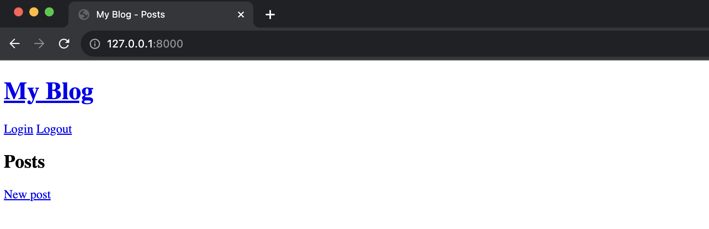

# django-test-demo

Django テストのサンプル。
簡単なブログアプリを用意したので、それを対象にテストを書いていく。

## 環境構築

以下に環境構築手順を記載する。
Python のバージョンは 3.10 を使用する。

1. 本リポジトリをクローンする

2. ルートディレクトリに移動し、仮想環境を作成する

   ```bash
   $ cd django-test-demo
   $ python3 -m venv venv
   ```

3. 仮想環境を有効化する

   ```bash
   $ source venv/bin/activate
   ```

4. 依存パッケージをインストールする

   ```bash
   $ pip install -r requirements.txt
   ```

5. マイグレーションを実行する

   ```bash
   $ python manage.py migrate
   ```

6. 開発用サーバーを起動する

   ```bash
   $ python manage.py runserver
   ```

7. ブラウザで http://127.0.0.1:8000/ にアクセスする

   以下の画面が表示されれば成功。
   

**補足**

- このアプリはあくまでもテストのサンプルなので、UI は最低限のものしか用意していない。
- `python manage.py createsuperuser`コマンドで管理者アカウントを作成することができ、このアカウントでログインすることで、記事の作成・編集・削除ができるようになる。
- ブログのカテゴリーはデフォルトでは用意していないため、管理画面から作成する必要がある。

## テスト

テストは以下のコマンドで実行できる。

```bash
$ python manage.py test
```

結果は以下のように表示される。

```bash
$ python manage.py test
Found 50 test(s).
Creating test database for alias 'default'...
System check identified no issues (0 silenced).
..................................................
----------------------------------------------------------------------
Ran 50 tests in 2.967s

OK
Destroying test database for alias 'default'...
```
